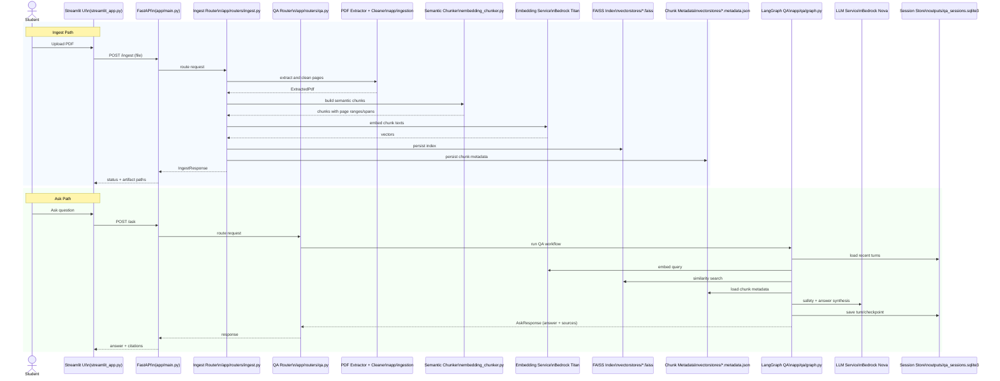

# Architecture

## System Overview
This project is a local-first Retrieval-Augmented Generation (RAG) assistant for textbook-style PDFs.

Core flow:
1. Upload PDF to `/ingest`.
2. Extract and clean page text.
3. Build semantic chunks with page-source spans.
4. Generate embeddings and persist FAISS + metadata artifacts.
5. Ask questions via `/ask`.
6. Run LangGraph workflow: safety -> retrieval -> confidence gate -> answer synthesis.

Main components:
- API layer: FastAPI routers in `app/routers`.
- Ingestion: PDF extraction, cleaning, semantic chunking, embedding pipeline in `app/ingestion`.
- Retrieval: Bedrock embeddings + FAISS index search in `app/retrieval`.
- Orchestration: LangGraph workflow in `app/qa/graph.py`.
- UI: Streamlit client in `streamlit_app.py`.

## Architecture Diagram (GitHub Rendered)
GitHub Markdown does not render PlantUML blocks by default. The equivalent Mermaid sequence below renders directly on GitHub.

## End-to-End Request Lifecycles

### Ingest lifecycle
1. Client uploads PDF bytes to `/ingest`.
2. PDF is parsed page-by-page and normalized for downstream retrieval.
3. Semantic chunking builds coherent chunks across page boundaries when needed.
4. Embeddings are generated for each chunk.
5. FAISS index and metadata JSON are stored locally.
6. API returns index and metadata artifact locations.

### Ask lifecycle
1. Client sends `student_id`, `question`, `grade_level` to `/ask`.
2. LangGraph executes safety classification before retrieval.
3. Query embedding is computed; top-k chunks are retrieved from FAISS.
4. Confidence gating decides whether context is sufficient.
5. LLM generates concise grounded answer using retrieved chunks.
6. Sources are returned with page attribution (`page`, `page_start`, `page_end`).
7. Session state and checkpoints are persisted.

## Data Contracts and Source Attribution

### Why source metadata is split into `page` and page ranges
- `page` is preserved for backward compatibility with existing clients.
- `page_start` and `page_end` capture cross-page chunk provenance.
- `source_spans` in chunk metadata retain per-page offset traceability.

### Citation integrity strategy
- Answer synthesis prompt explicitly instructs no invented facts/citations.
- Retrieved source IDs are created only from persisted chunk metadata.
- If retrieval confidence is low, system returns insufficient-context response.

## Design Choices

### 1) Semantic chunking with page attribution
Choice:
- Chunk by semantic blocks (headings, examples, practice/equation groups) rather than only fixed character windows.
- Preserve source traceability with `page_start`, `page_end`, and per-page `source_spans`.

Why:
- Textbooks often include layout noise, formulas, and examples that do not align to page boundaries.
- Better retrieval precision requires smaller, topic-coherent chunks.

Trade-off:
- More logic and heuristics in chunking.
- Heading detection may still need tuning for unusual PDFs.

### 2) Local FAISS for retrieval
Choice:
- Persist embeddings in FAISS (`IndexFlatIP`) with normalized vectors and JSON metadata.

Why:
- Simple, fast local setup.
- No managed vector DB dependency for the assignment.

Trade-off:
- No built-in filtering, hybrid search, or reranking unless explicitly added.

Alternative considered:
- Managed vector databases (OpenSearch/Pinecone/Weaviate) were not chosen for this assignment to keep setup local and reproducible.

### 3) LangGraph for QA orchestration
Choice:
- Use a graph workflow with explicit steps: safety classification, retrieval, confidence gating, answer generation, and logging.

Why:
- Clear control flow and easier extension.
- Easy insertion points for policy and observability.

Trade-off:
- Slightly more framework complexity than a single function pipeline.

Alternative considered:
- A linear service method is simpler initially but harder to extend safely with policy and evaluation gates.

### 4) Strict source-grounded answering
Choice:
- Prompt and confidence gate enforce: no hallucinated citations/facts; return insufficient when context is weak.

Why:
- Matches assignment safety and citation requirements.

Trade-off:
- Can be conservative when retrieval score is low.

## PDF Ingestion Approach
1. Parse uploaded PDF bytes page by page.
2. Clean extraction noise while preserving math content.
3. Build semantic blocks from cleaned text.
4. Pack blocks into bounded chunks using configurable targets and overlap.
5. Embed chunks.
6. Persist FAISS index and chunk metadata JSON.

Artifacts:
- Cleaned extraction JSON in `outputs/`.
- Vector index + metadata in `vectorstores/`.

## Retrieval and Generation Strategy

### Current strategy
- Dense retrieval via Bedrock embeddings + FAISS cosine-equivalent search (L2-normalized inner product).
- Top-k chunk selection followed by confidence thresholding.
- Prompted grounded generation with explicit insufficiency behavior.

### Why this is practical
- Minimal infrastructure overhead.
- Fast local artifact reads.
- Good baseline quality once chunking is semantic.

### Known limitations
- Keyword-only edge cases can be missed without lexical retrieval.
- No reranker means final ordering relies on embedding similarity only.

## Failure Modes and Handling

### Ingest-time failures
- Invalid/non-PDF input -> `400`.
- Empty uploads -> `400`.
- PDF parse failures -> `400`.
- Embedding/runtime provider failures -> `502`.
- No usable text/chunks -> `400`.

### Ask-time failures
- Missing vector artifacts -> `404`.
- Invalid request payload -> `400`.
- Retrieval/generation runtime failures -> `502`.

### External dependency failures
- Bedrock credential/config issues -> surfaced as runtime failures.
- Transient provider latency/errors -> currently fail-fast at API layer.
- Mitigation path: retry policy, circuit breaking, and deterministic fallback mode for tests.

### Quality-related failure modes
- Noisy OCR-like pages may degrade chunking.
- Weak heading detection can reduce source title quality.
- Pure semantic vector search may miss lexical edge-cases without hybrid retrieval.
- Very long formulas/tables may still produce suboptimal chunks.

## Scaling Approach

### Near-term (single node)
- Keep local FAISS and file-based artifacts.
- Add background ingest workers if upload volume grows.
- Cache/reuse embedding clients to reduce initialization overhead.
- Add async job status endpoint for long-running ingest operations.

### Mid-term
- Partition indexes per document/course and route by namespace.
- Add hybrid retrieval (keyword + vector) and optional reranking.
- Add deterministic mock mode for test and CI runs.
- Add offline evaluation harness and retrieval regression suite.

### Larger scale
- Replace local artifacts with object storage + managed vector store.
- Move session state and checkpoints to managed DB.
- Introduce queue-based ingestion and horizontal API workers.
- Add tracing and evaluation dashboards for retrieval quality and safety rates.

## Testing and Evaluation Notes
- Unit and integration test coverage should target:
	- chunk boundary correctness,
	- citation/page attribution integrity,
	- safety routing behavior,
	- insufficient-context behavior.
- A deterministic evaluation script is included to validate chunk metadata quality without external API calls.

## Security and Operational Notes
- Do not store API keys in source.
- Keep provider credentials in environment/secret manager.
- Log request IDs and high-level metrics; avoid sensitive payload logging.
- Validate and constrain uploads and response payload sizes.
